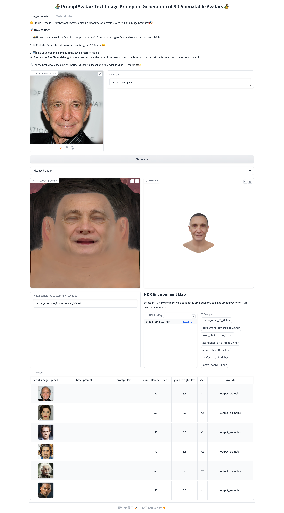
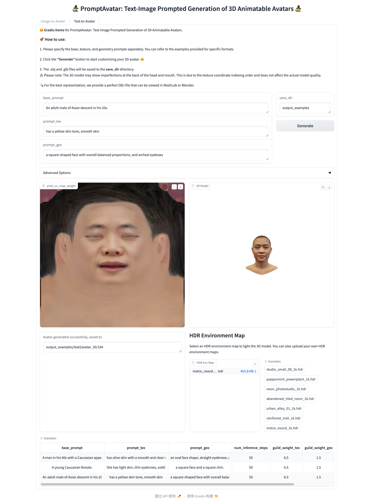

# PromptAvatar

## Dependencies

- Linux + Anaconda
- CUDA 11.8
- Python 3.10

Environment Setup

* conda env:

  ```shell
  conda create -n promptavatar python=3.10
  conda activate promptavatar
  ```

- insightface:

  ```shell
  pip install insightface
  ```
- PyTorch 2.1.1:

  ```shell
  pip install torch==2.1.1 torchvision==0.16.1 torchaudio==2.1.1 --index-url https://download.pytorch.org/whl/cu118
  ```
- gradio:

  ```
  pip install gradio
  ```
- Other packages:
- ```
  pip install diffusers transformers accelerate basicsr timm onnxruntime-gpu scikit-image opencv-python pillow imageio matplotlib Ninja google-auth google-auth-oauthlib requests pyspng imageio-ffmpeg scikit-learn torchdiffeq flask kornia lmdb psutil dominate rtree tensorboard  trimesh
  ```
- Nvdiffrast:
- ```shell
  mkdir third_party
  cd third_party

  git clone https://github.com/NVlabs/nvdiffrast
  pip install -e nvdiffrast
  cd ..
  ```

### Prepare checkpoints and topology assets:

* GoogleDrive: [download link](https://drive.google.com/drive/folders/1hcg5dCCzUlxzqwAjR5mdpILVmHmGIb5v?usp=sharing)

#### File structure for Checkpoints

```shell
checkpoints
|____lm_model
| |____68lm_detector.pb
|____GDM_model
| |____model.safetensors
|____vgg_model
| |____vgg16.pt
|____e4e_model
| |____e4e_ffhq_encode.pt
|____stylegan_model
| |____stylegan2-ffhq-config-f.pkl
|____TDM_model
| |____model.safetensors
|____texgan_model
| |____texgan_ffhq_uv.pth
| |____texgan_cropface630resize1024_ffhq_uv_interpolate.pth
| |____texgan_ffhq_uv.pt
|____mtcnn_model
| |____mtcnn_model.pb
|____exprecog_model
| |____FacialExpRecognition_model.t7
|____deep3d_model
| |____epoch_latest.pth
|____sd21
| |____vae
| | |____config.json
| | |____diffusion_pytorch_model.bin
| |____scheduler
| | |____scheduler_config.json
| |____model_index.json
| |____unet
| | |____config.json
| | |____diffusion_pytorch_model.safetensors
| |____tokenizer
| | |____vocab.json
| | |____tokenizer_config.json
| | |____special_tokens_map.json
| | |____merges.txt
| |____text_encoder
| | |____model.safetensors
| | |____config.json
| |____feature_extractor
| | |____preprocessor_config.json
|____face_analysis_model_path
| |____models
| | |____antelopev2
| | | |____scrfd_10g_bnkps.onnx
| | | |____1k3d68.onnx
| | | |____glintr100.onnx
| | | |____2d106det.onnx
| | | |____genderage.onnx
|____dpr_model
| |____trained_model_03.t7
|____resnet_model
| |____resnet18-5c106cde.pth
|____vae_fintuned
| |____vae
| | |____config.json
| | |____diffusion_pytorch_model.safetensors
|____dlib_model
| |____shape_predictor_68_face_landmarks.dat
|____parsing_model
| |____79999_iter.pth
|____arcface_model
| |____ms1mv3_arcface_r50_fp16_backbone.pth
|____styleflow_model
| |____expression_direction.pt
| |____modellarge10k.pt
|____Real-ESRGAN
| |____weights
| | |____RealESRGAN_x4plus.pth

```

#### File structure for topology assets

```shell
assets_topo
|____major_valid_front_mask.png
|____major_valid_right_mask.png
|____nostril_mask.png
|____minor_valid_left_mask.png
|____minor_valid_right_mask.png
|____minor_valid_whole_mask.png
|____mouth_constract_mask.png
|____unwrap_1024_info.mat
|____hifi3dpp_model_info.mat
|____unwrap_1024_info_mask.png
|____similarity_Lm3D_all.mat
|____nosal_base_mask.png
|____hair_mask.png
|____template_base_uv.png
|____minor_valid_front_mask.png
|____major_valid_left_mask.png
|____download and put here
|____hifi3dpp_mean_face.obj
|____center_face_mask.png
|____major_valid_whole_mask.png

```

## Start a local gradio demo

Run the following command:

```python
python infer_gradio_app_3d.py
```

Play in this demo:





# Acknowledgments

This implementation builds upon the awesome works done by [Deep3D](https://github.com/sicxu/Deep3DFaceRecon_pytorch), [InstantID](https://github.com/InstantID/InstantID), [NeRFFaceLighting](https://github.com/IGLICT/NeRFFaceLighting), [DPR](https://github.com/zhhoper/DPR), [E4E](https://github.com/omertov/encoder4editing), [face-parsing.PyTorch](https://github.com/zllrunning/face-parsing.PyTorch), [insightface](https://github.com/deepinsight/insightface), [latent-diffusion](https://github.com/CompVis/latent-diffusion), [diffusers](https://github.com/huggingface/diffusers), [nvdiffrast](https://github.com/NVlabs/nvdiffrast), [FFHQ](https://github.com/NVlabs/ffhq-dataset) and [stable-fast-3d](https://github.com/Stability-AI/stable-fast-3d).

This work is based on HiFi3D++ topology assets from [REALY](https://github.com/czh-98/REALY) and [FFHQ-UV](https://github.com/csbhr/FFHQ-UV).